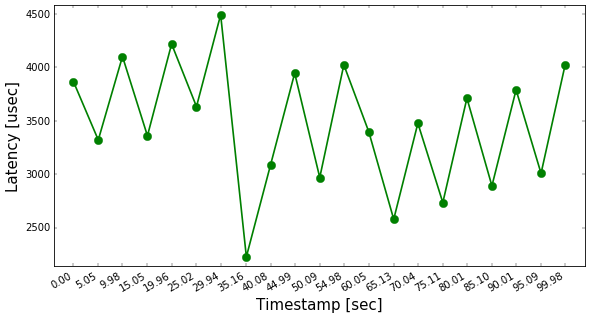
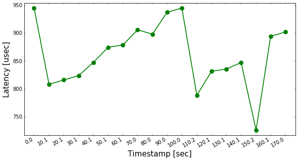

RT WiFi Scanner
===============

# Overview
RT WiFi Scanner is an application that scans the nearby available WiFi networks. 
Its purpose is to provide useful data that can be analyzed in order to extract information regarding the movement of a person or a vehicle. 
It is designed to run with **real-time** guarantees for an **embedded** device.

To execute the program, run: 
`$ make` 
`$ sudo ./rt_wifi_scanner [cycle_time]`

# Real-Time Linux
The normal Linux distribution does not offer **hard** real-time capabilities. 
In order to achieve those, a real-time preemption patch (*RT-PREEMPT*) is applied to the Linux kernel.

#### Performance
The overall performance of the OS is degraded, but **determinism** (predictability) is provided. 
In contrast to a normal OS that uses soft real-time, the average error (throughput) is increased, but the maximum error (predictability) is decreased. 
This means that *throughput is not the top priority* of the OS, and will be sacrificed if needed.

#### RT-PREEMPT Patch
For resources about building and configuring the real-time kernel, see [this](https://wiki.linuxfoundation.org/realtime/documentation/howto/applications/preemptrt_setup) page. 
For information on how to build a real-time application, see [this](https://wiki.linuxfoundation.org/realtime/documentation/howto/applications/application_base) page.

#### Platform
This program is aimed at devices running real-time Linux. 
For experimental purposes, it was run on a **BCM2837** board (Raspberry Pi 3). 
The board is comprised of a quad-core ARM Cortex-A53 (ARMv8 architecture), running on 1.2 GHz, with 1GB RAM (power consumption is around 800 mA). 
The hosting OS is a Linux flavor, specific to RPi, called Raspbian. 
The tests run on a 4.4.34 Linux kernel.

# Implementation
The **main entry** of the system is the scheduler. Its purpose is to **execute and monitor** all the tasks needed to complete a full cycle. 
Two tasks run in parallel (in separate threads) using the Round-robin scheduling policy. 
Also, all both tasks share the same core (CPU affinity is 1).

These tasks are: 
1. The **read task**, that calls a shell script to read the WiFi's available SSIDs and stores them along with their timestamp to a buffer. 
This task is *cyclic executive*, with a cycle time provided by the user. 
So, the task has a specific time slice (interval) under which it has to perform its function, otherwise, it is preempted.  
2. The **store task**, that copies the buffer content locally and writes the seen SSIDs along with all their timestamps to a file. 
This task is not cyclic, thus it waits on the buffer (queue) to be filled.

For the above purposes, a **producer/consumer** model was adopted, with the read task (synchronous) acting as the producer and the store task (asynchronous) acting as the consumer. 
In addition, a queue structure was created to act as a fixed size buffer between the two tasks, that contains the new SSIDs and their corresponding timestamp. 
And since the number of samples is not known initially, every time a new one arrives, the size of the locally stored information is extended.

# Tests & Results
An important aspect of the implementation is the **difference in time** between the moment an SSID is read and the moment it is stored to the output file. 
This latency is crucial in the analysis of the information that comes from the WiFi and can help provide better movement estimates.

To evaluate the magnitude of this latency, two experiments were carried out on the embedded device. 
In the first test, the cycle time of the read task was 5 seconds and in the second test, it was 10 seconds. 
It is worth noticing that the script that reads the WiFi networks takes around 3 seconds to execute.

The result of the first experiment can be seen here:

With 5 seconds as a cycle time, the latency is around 3-4 ms.

Similar results were noted with the second experiment:

With 10 seconds as a cycle time, the latency is around 0.8-0.9 ms. 
This is expected, since the consumer task has more time to perform its actions.

# Problems & Improvements
1. Because the program runs forever, and the memory is allocated dynamically, it will eventually **run out of memory**. 
Since the application's objective is to extract information about a moving device, previously detected SSIDs will probably not appear again. 
This gives the opportunity to use storage of **fixed size** and recycle SSIDs and timestamps by time of appearance.  
2. The read/store tasks can cause **latency issues** if the buffer is too small or if the cycle time of the task is too short. 
A solution to this would be to **preempt** the tasks that exceed their time slice. 
However, that would imply the loss of data at the cost of lower latency.

 
 
*Dimitrios Panagiotis G. Geromichalos* 
*August, 2017*